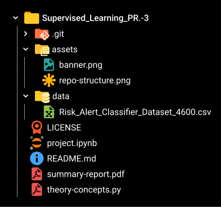

<div align="center">
	
</div>

# ⚠️ Risk Alert Classifier

<div align="center">


</div>

---

## 📚 Overview
Welcome to the **Risk Alert Classifier**! This project leverages supervised learning to predict high-risk customer behavior using real-world data and advanced classification techniques. It is designed as a comprehensive academic submission, showcasing both conceptual understanding and practical implementation.

---

## 📝 Project Title
### 🎓 Risk Alert Classifier

---

## 👨‍🎓 Student Submission
> _This repository is submitted as part of coursework to demonstrate mastery of supervised learning, model evaluation, and optimization._

---

## 🎯 Objective
Design, implement, analyze, and evaluate multiple supervised learning models to predict high-risk customer behavior using structured banking data. The project emphasizes:

- 📊 Classification Modeling
- ⚖️ Class Imbalance Handling
- 🧠 Model Evaluation with Recall, F1-Score, and AUC-ROC
- 🔧 Hyperparameter Tuning with Randomized and Grid Search

---

## 🏢 Problem Statement
You are working as a **Data Scientist** for a digital banking platform. The bank wants to build an **early-warning system** that identifies **high-risk customers** who are likely to default on payments or engage in fraudulent behavior.

Your task is to build a **robust classification pipeline** that:

- Handles **highly imbalanced data** effectively
- Compares **Logistic Regression, Decision Tree, and Random Forest** models
- Evaluates performance using **recall, F1-score, confusion matrix, and ROC-AUC**
- Improves model performance using **sampling techniques and hyperparameter tuning**

The final solution must reliably identify risky customers while minimizing missed alerts.

---

## 📂 Repository Structure



---

## 📊 Results & Analysis
- **Best Model:** The tuned Random Forest model was selected as the preferred classifier for this use case because it performed strongly on the structured risk dataset and improved generalization over a single Decision Tree.
- **Class Imbalance:** Under-sampling, over-sampling, SMOTE, and ADASYN were compared to improve the model's ability to detect the minority high-risk class.
- **Evaluation Metrics:** The models were assessed using accuracy, precision, recall, F1-score, confusion matrix, and ROC-AUC.
- **Business Interpretation:** The system supports early detection of high-risk customers, helping reduce missed alerts and improve fraud or default prevention.

---


---

## 🛠️ Installation & Usage

**1. Clone the repository:**

```bash
git clone https://github.com/Prath-Digital/Supervised_Learning_PR.-3.git
cd Supervised_Learning_PR.-3
```

**2. Install dependencies:**

```bash
pip install pandas numpy matplotlib seaborn scikit-learn imbalanced-learn
```

**3. Run the notebook:**

Open `project.ipynb` in Jupyter Notebook or VS Code and execute the cells sequentially.

---


## 📚 References & Resources
- [Scikit-learn Documentation](https://scikit-learn.org/)
- [Pandas Documentation](https://pandas.pydata.org/)
- [Seaborn Documentation](https://seaborn.pydata.org/)
- [imbalanced-learn Documentation](https://imbalanced-learn.org/)

---


## ✅ Submission Checklist
- [x] Source code (`project.ipynb`)
- [x] Model evaluation results
- [x] Graphs and plots
- [x] Summary report (`summary-report.pdf`)
- [x] Conceptual answers (`theory-concepts.pdf`)

---


## 📧 Contact
For any queries, please contact the student or faculty as per submission guidelines.

---

## &copy; License
This project is for academic purposes only. See [`LICENSE`](./LICENSE) for details.